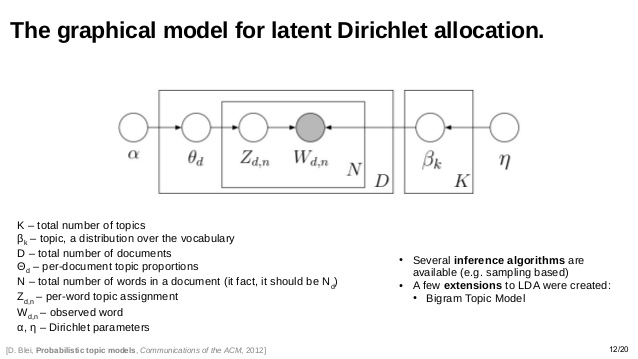
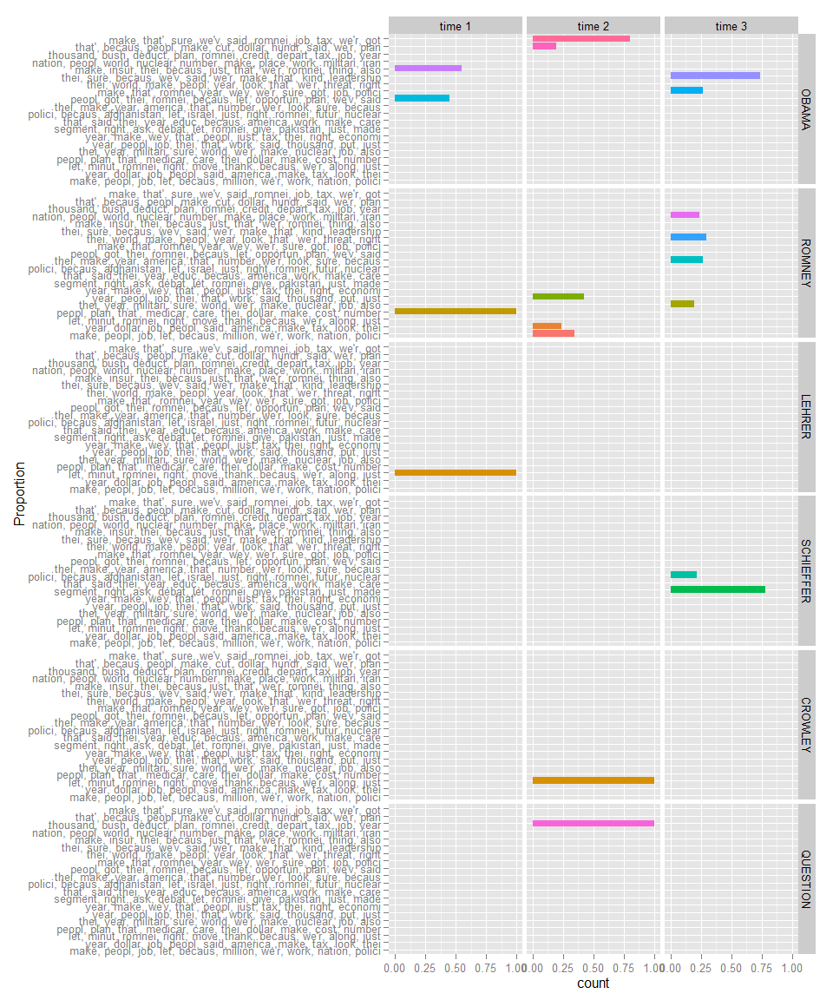
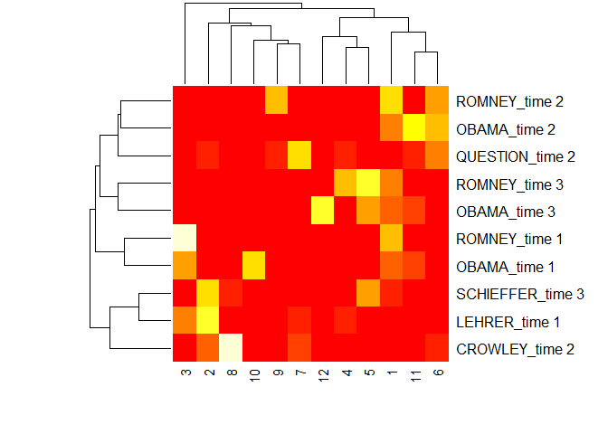
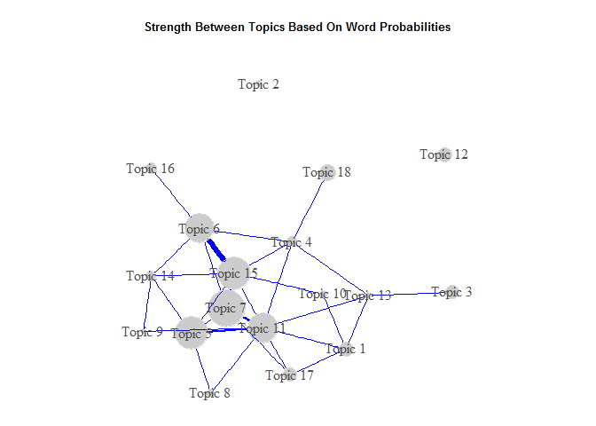
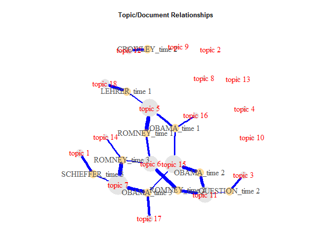
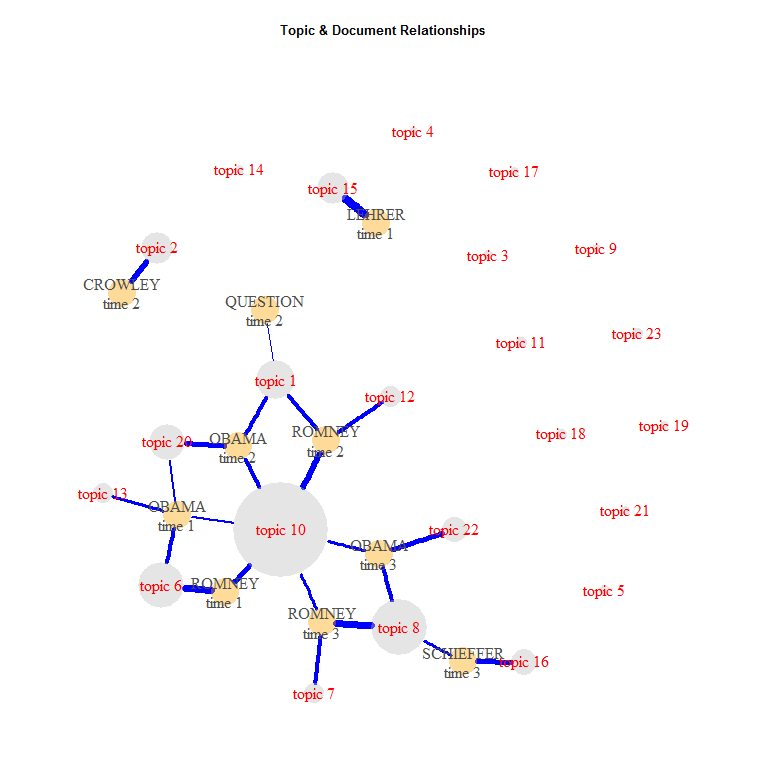

Topic Models Learning and R Resources 
============

This is a collection documenting the resources I find related to topic
models with an R flavored focus. A *topic model* is a type of
[*generative*](http://stackoverflow.com/questions/879432/what-is-the-difference-between-a-generative-and-discriminative-algorithm)
model used to "discover" latent topics that compose a *corpus* or
collection of documents. Typically topic modeling is used on a
collection of text documents but can be used for other modes including
use as caption generation for images.

Table of Contents
============

-   [Just the Essentials](#just-the-essentials)
-   [Key Players](#key-players)
-   [Videos](#videos)
    -   [Introductory](#introductory)
    -   [Theory](#theory)
    -   [Visualization](#visualization)
-   [Articles](#articles)
    -   [Applied](#applied)
    -   [Theoretical](#theoretical)
-   [Websites & Blogs](#websites--blogs)
-   [R Resources](#r-resources)
    -   [Package Comparisons](#package-comparisons)
    -   [R Specific References](#r-specific-references)
    -   [Example Modeling](#example-modeling)
-   [Topic Modeling R Demo](#topic-modeling-r-demo)
    -   [topicmodels Package](#topicmodels-package)
-   [Contributing](#contributing)

Just the Essentials
============

This is my run down of the minimal readings, websites, videos, & scripts
the reader needs to become familiar with topic modeling. The list is in
an order I believe will be of greatest use and contains a nice mix of
introduction, theory, application, and interpretation. As you want to
learn more about topic modeling, the other sections will become more
useful.

1.  Boyd-Graber, J. (2013). [Computational Linguistics I: Topic
    Modeling](https://www.youtube.com/watch?v=4p9MSJy761Y)  
2.  Underwood, T. (2012). [Topic Modeling Made Just Simple
    Enough](http://tedunderwood.com/2012/04/07/topic-modeling-made-just-simple-enough/)
3.  Weingart, S. (2012). [Topic Modeling for Humanists: A Guided
    Tour](http://www.scottbot.net/HIAL/?p=19113)
4.  Blei, D. M. (2012). [Probabilistic topic
    models](/articles/Blei2012.pdf). *Communications of the ACM, (55)*4,
    77-84. <doi:10.1145/2133806.2133826>  
5.  inkhorn82 (2014). [A Delicious Analysis! (aka topic modelling using
    recipes)](http://rforwork.info/2014/02/17/a-delicious-analysis/)
    [(CODE)](https://gist.githubusercontent.com/inkhorn/9044779/raw/c7f0ba30d424aaeb75c5e221d12566f6732c4f29/recipe%20analysis.R)
6.  Grüen, B. & Hornik, K. (2011). [topicmodels: An R Package for
    Fitting Topic Models.](/articles/Gruen2011.pdf). *Journal of
    Statistical Software, 40*(13), 1-30.
7.  Marwick, B. (2014a). [The input parameters for using latent
    Dirichlet allocation](http://stats.stackexchange.com/a/25128/7482)
8.  Tang, J., Meng, Z., Nguyen, X. , Mei, Q. , & Zhang, M. (2014).
    [Understanding the limiting factors of topic modeling via posterior
    contraction analysis](/articles/Tang2014.pdf). In *31 st
    International Conference on Machine Learning*, 190-198.
9.  Sievert, C. (2014). [LDAvis: A method for visualizing and
    interpreting topic
    models](https://www.youtube.com/watch?v=IksL96ls4o0)
10. Rhody, L. M. (2012). [Some Assembly Required: Understanding and Interpreting Topics in LDA Models of Figurative Language](http://www.lisarhody.com/some-assembly-required)
11. Rinker, T.W. (2015). [R Script: Example Topic Model
    Analysis](https://raw.githubusercontent.com/trinker/topicmodels_learning/master/scripts/Example_topic_model_analysis.R)

Key Players
===========

Papadimitriou, Raghavan, Tamaki & Vempala, Santosh (1997) first
introduced the notion of topic modeling in their ["Latent Semantic
Indexing: A probabilistic analysis"](/articles/Papadimitriou1997.pdf).
Thomas Hofmann (1999) developed "Probabilistic latent semantic
indexing". Blei, Ng, & Jordan (2003) proposed *latent Dirichlet
allocation* (LDA) as a means of modeling documents with multiple topics
but assumes the topic are uncorrelated. Blei & Lafferty (2007) proposed
*correlated topics model* (CTM), extending LDA to allow for correlations
between topics. Roberts, Stewart, Tingley, & Airoldi (2013) propose a
[*Structural Topic Model*](/articles/Roberts2013.pdf) (STM), allowing
the inclusion of meta-data in the modeling process.

Videos
======

Introductory
------------

-   Boyd-Graber, J. (2013). [Computational Linguistics I: Topic
    Modeling](https://www.youtube.com/watch?v=4p9MSJy761Y)

Theory
------

-   Blei, D. (2007) [Modeling Science: Dynamic Topic Models of Scholarly
    Research](https://www.youtube.com/watch?v=7BMsuyBPx90)
-   Blei, D. (2009) [Topic Models: Parts I &
    II](http://videolectures.net/mlss09uk_blei_tm/#) ([Lecture
    Notes](/presentations/Blei2009.pdf))
-   Jordan, M. (2014) [A Short History of Topic
    Models](https://www.youtube.com/watch?v=fBNsHPtTAGs)

Visualization
-------------

-   Sievert, C. (2014) [LDAvis: A method for visualizing and
    interpreting topic
    models](https://www.youtube.com/watch?v=IksL96ls4o0)
-   Maybe, B. (2015) [SavvySharpa: Visualizing Topic
    Models](https://www.youtube.com/watch?v=tGxW2BzC_DU)

Articles
========

Applied
-------

-  Marwick, B. 2013. [Discovery of Emergent Issues and Controversies in Anthropology Using Text Mining, Topic Modeling, and Social Network Analysis of Microblog Content](https://www.academia.edu/5508141/Discovery_of_Emergent_Issues_and_Controversies_in_Anthropology_Using_Text_Mining_Topic_Modeling_and_Social_Network_Analysis_of_Microblog_Content). In Yanchang Zhao, Yonghua Cen (eds) Data Mining Applications with R. Elsevier. p. 63-93

-  Newman, D.J. & Block, S. (2006). [Probabilistic topic decomposition of
an eighteenth-century American newspaper](/articles/Newman2006.pdf).
*Journal of the American Society for Information Science and Technology.
57*(6), 753-767. <doi:10.1002/asi.v57:6>

Theoretical
-----------

-   Blei, D. M. (2012). [Probabilistic topic
    models](/articles/Blei2012.pdf). *Communications of the ACM, (55)*4,
    77-84. <doi:10.1145/2133806.2133826>
-   Blei, D. M. & Lafferty, J. D. (2007) [A correlated topic model of
    Science](/articles/Blei2007.pdf). *The Annals of Applied Statistics
    1*(1), 17-35. <doi:10.1214/07-AOAS114>
-   Blei, D. M. & Lafferty, J. D. (2009) [Topic
    models](/articles/Blei2009.pdf). In A Srivastava, M Sahami (eds.),
    [*Text mining: classification, clustering, and
    applications*](/articles/Srivastava2009.pdf). Chapman & Hall/CRC
    Press. 71-93.  
-   Blei, D. M. & McAuliffe, J. (2008). [Supervised topic
    models](/articles/Blei2008.pdf). In Advances in Neural Information
    Processing Systems 20, 1-8.
-   Blei, D. M., Ng, A.Y., & Jordan, M.I. (2003). [Latent Dirichlet
    Allocation](/articles/Blei2003.pdf). *Journal of Machine Learning
    Research, 3*, 993-1022.
-   Chang, J., Boyd-Graber, J. , Wang, C., Gerrish, S., & Blei. D.
    (2009). [Reading tea leaves: How humans interpret topic
    models](/articles/Chang2009.pdf). In *Neural Information Processing
    Systems*.
-   Griffiths, T.L. & Steyvers, M. (2004). [Finding Scientific
    Topics](/articles/Griffiths2004.pdf). Proceedings of the National
    Academy of Sciences of the United States of America, 101, 5228-5235.
-   Griffiths, T.L., Steyvers, M., & Tenenbaum, J.B.T. (2007). [Topics
    in Semantic Representation](/articles/Griffiths2007.pdf).
    *Psychological Review, 114*(2), 211-244.
-   Grüen, B. & Hornik, K. (2011). [topicmodels: An R Package for
    Fitting Topic Models.](/articles/Gruen2011.pdf). *Journal of
    Statistical Software, 40*(13), 1-30.
-   Mimno, D. & A. Mccallum. (2007). [Organizing the OCA: learning
    faceted subjects from a library of digital
    books](/articles/Mimno2007.pdf). In *Joint Conference on Digital
    Libraries*. ACM Press, New York, NY, 376–385.
-   Ponweiser, M. (2012). [Latent Dirichlet Allocation in R (Diploma
    Thesis)](/articles/Ponweiser2012.pdf). Vienna University of
    Economics and Business, Vienna
-   Roberts M.E., Stewart B.M., Tingley D., & Airoldi E.M. (2013) [The
    Structural Topic Model and Applied Social
    Science](/articles/Roberts2013.pdf). *Advances in Neural Information
    Processing Systems Workshop on Topic Models: Computation,
    Application, and Evaluation*, 1-4.  
-   Roberts, M., Stewart, B., Tingley, D., Lucas, C., Leder-Luis, J.,
    Gadarian, S., Albertson, B., et al. (2014). [Structural topic models
    for open ended survey responses](/articles/Roberts2014.pdf).
    *American Journal of Political Science, American Journal of
    Political Science, 58*(4), 1064-1082.
-   Roberts, M., Stewart, B., Tingley, D. (n.d.). [stm: R Package for
    Structural Topic Models](/articles/Robertsnd.pdf), 1-49.
-   Sievert, C. & Shirley, K. E. (2014a). [LDAvis: A Method for
    Visualizing and Interpreting Topics.](/articles/Sievert2014a.pdf) in
    *Proceedings of the Workshop on Interactive Language Learning,
    Visualization, and Interfaces* 63-70.
-   Steyvers, M. & Griffiths, T. (2007). [Probabilistic topic
    models](/articles/Steyvers2007.pdf). In T. Landauer, D McNamara, S.
    Dennis, and W. Kintsch (eds), *Latent Semantic Analysis: A Road to
    Meaning*. Laurence Erlbaum
-   Taddy, M.A. (2012). [On Estimation and Selection for Topic
    Models](/articles/Taddy2012.pdf) In *Proceedings of the 15th
    International Conference on Artificial Intelligence and Statistics
    (AISTATS 2012)*, 1184-1193.
-   Tang, J., Meng, Z., Nguyen, X. , Mei, Q. , & Zhang, M. (2014).
    [Understanding the limiting factors of topic modeling via posterior
    contraction analysis](/articles/Tang2014.pdf). In *31 st
    International Conference on Machine Learning*, 190-198.

Websites & Blogs
================

-   Blei, D. (n.d.). [Topic
    Modeling](https://www.cs.princeton.edu/~blei/topicmodeling.html)
-   Jockers, M.L. (2013). ["Secret" Recipe for Topic Modeling
    Themes](http://www.matthewjockers.net/2013/04/12/secret-recipe-for-topic-modeling-themes/)
-   Jones, T. (n.d.). [Topic Models Reading
    List](http://www.biasedestimates.com/p/topic-models-reading-list.html)
-   Marwick, B. (2014a). [The input parameters for using latent
    Dirichlet allocation](http://stats.stackexchange.com/a/25128/7482)
-   Marwick, B. (2014b). [Topic models: cross validation with
    loglikelihood or
    perplexity](http://stackoverflow.com/a/21394092/1000343)
-   Rhody, L. M. (2012). [Some Assembly Required: Understanding and Interpreting 
    Topics in LDA Models of Figurative Language](http://www.lisarhody.com/some-assembly-required)
-   Schmidt, B.M. (2012). [Words Alone: Dismantling Topic Models in the
    Humanities](http://journalofdigitalhumanities.org/2-1/words-alone-by-benjamin-m-schmidt/)
-   Underwood, T. (2012a). [Topic Modeling Made Just Simple
    Enough](http://tedunderwood.com/2012/04/07/topic-modeling-made-just-simple-enough/)
-   Underwood, T. (2012b). [What kinds of "topics" does topic modeling
    actually
    produce?](http://tedunderwood.com/2012/04/01/what-kinds-of-topics-does-topic-modeling-actually-produce/)
-   Weingart, S. (2012). [Topic Modeling for Humanists: A Guided
    Tour](http://www.scottbot.net/HIAL/?p=19113)
-   Weingart, S. (2011). [Topic Modeling and Network
    Analysis](http://www.scottbot.net/HIAL/?p=221)

R Resources
===========

Package Comparisons
-------------------

<table>
<thead>
<tr class="header">
<th align="left">Package</th>
<th align="left">Functionality</th>
<th align="left">Pluses</th>
<th align="left">Author</th>
<th align="left">R Language Interface</th>
</tr>
</thead>
<tbody>
<tr class="odd">
<td align="left">lda*</td>
<td align="left">Collapsed Gibbs for LDA</td>
<td align="left">Graphing utilities</td>
<td align="left">Chang</td>
<td align="left">R</td>
</tr>
<tr class="even">
<td align="left">topicmodels</td>
<td align="left">LDA and CTM</td>
<td align="left">Follows Blei's implementation; great vignette; takes</td>
<td align="left">C</td>
<td align="left"><a href="https://en.wikipedia.org/wiki/Document-term_matrix">DTM</a></td>
</tr>
<tr class="odd">
<td align="left">stm</td>
<td align="left">Model w/ meta-data</td>
<td align="left">Great documentation; nice visualization</td>
<td align="left">Roberts, Stewart, &amp; Tingley</td>
<td align="left">C</td>
</tr>
<tr class="even">
<td align="left">LDAvis</td>
<td align="left">Interactive visualization</td>
<td align="left">Aids in model interpretation</td>
<td align="left">Sievert &amp; Shirley</td>
<td align="left">R + Shiny</td>
</tr>
<tr class="odd">
<td align="left">mallet**</td>
<td align="left">LDA</td>
<td align="left"><a href="http://programminghistorian.org/lessons/topic-modeling-and-mallet">MALLET</a> is well known</td>
<td align="left">Mimno</td>
<td align="left">Java</td>
</tr>
</tbody>
</table>

\*[*StackExchange discussion of lda vs.
topicmodels*](http://stats.stackexchange.com/questions/24441/two-r-packages-for-topic-modeling-lda-and-topicmodels)  
\*\*[*Setting Up
MALLET*](http://programminghistorian.org/lessons/topic-modeling-and-mallet)

R Specific References
---------------------

-   Chang J. (2010). lda: Collapsed Gibbs Sampling Methods for Topic
    Models. <http://CRAN.R-project.org/package=lda>.
-   Grüen, B. & Hornik, K. (2011). [topicmodels: An R Package for
    Fitting Topic Models.](/articles/Gruen2011.pdf). *Journal of
    Statistical Software, 40*(13), 1-30.
-   Mimno, D. (2013). [vignette-mallet: A wrapper around the Java
    machine learning tool MALLET](/articles/Mimno2013.Rmd).
    <https://CRAN.R-project.org/package=mallet>
-   Ponweiser, M. (2012). [Latent Dirichlet Allocation in R (Diploma
    Thesis)](/articles/Ponweiser2012.pdf). Vienna University of
    Economics and Business, Vienna.
-   Roberts, M., Stewart, B., Tingley, D. (n.d.). [stm: R Package for
    Structural Topic Models](/articles/Robertsnd.pdf), 1-49.
-   Sievert, C. & Shirley, K. E. (2014a). [LDAvis: A Method for
    Visualizing and Interpreting Topics.](Sievert2014a.pdf) *Proceedings
    of the Workshop on Interactive Language Learning, Visualization, and
    Interfaces* 63-70.
-   Sievert, C. & Shirley, K. E. (2014b). [Vignette: LDAvis
    details.](/articles/Sievert2014b.pdf) 1-5.

Example Modeling
----------------

-   Awati, K. (2015). [A gentle introduction to topic modeling using
    R](https://eight2late.wordpress.com/2015/09/29/a-gentle-introduction-to-topic-modeling-using-r/)
-   Dubins, M. (2013). [Topic Modeling in Python and R: A Rather Nosy
    Analysis of the Enron Email
    Corpus](https://dzone.com/articles/topic-modeling-python-and-r)
-   Goodrich, B. (2015) [Topic Modeling Twitter Using
    R](https://www.linkedin.com/pulse/topic-modeling-twitter-using-r-bryan-goodrich)
    [(CODE)](https://gist.githubusercontent.com/bryangoodrich/7b5ef683ce8db592669e/raw/3402e7390d10a0282dc0d6309ed4df9a4fb1cf5d/TwitterTopics.r)
-   inkhorn82 (2014). [A Delicious Analysis! (aka topic modelling using
    recipes)](http://rforwork.info/2014/02/17/a-delicious-analysis/)
    [(CODE)](https://gist.githubusercontent.com/inkhorn/9044779/raw/c7f0ba30d424aaeb75c5e221d12566f6732c4f29/recipe%20analysis.R)
-   Jockers, M.L. (2014).[Introduction to Text Analysis and Topic
    Modeling with
    R](http://www.matthewjockers.net/materials/dh-2014-introduction-to-text-analysis-and-topic-modeling-with-r/)
-   Medina, L. (2015). [Conspiracy Theories - Topic Modeling & Keyword
    Extraction](http://voidpatterns.org/2015/03/conspiracy-theories-topic-modeling-keyword-extraction/)
-   Sievert, C. (n.d.). [A topic model for movie
    reviews](http://cpsievert.github.io/LDAvis/reviews/reviews.html)     
-   Sievert, C. (2014). [Topic Modeling In R](https://ropensci.org/blog/2014/04/16/topic-modeling-in-R/)

Topic Modeling R Demo
=====================

topicmodels Package
-------------------

The .R script for this demonstration can be downloaded from
[scripts/Example\_topic\_model\_analysis.R](https://raw.githubusercontent.com/trinker/topicmodels_learning/master/scripts/Example_topic_model_analysis.R)

### Install/Load Tools & Data

    if (!require("pacman")) install.packages("pacman")
    pacman::p_load_gh("trinker/gofastr")
    pacman::p_load(tm, topicmodels, dplyr, tidyr, igraph, devtools, LDAvis, ggplot2)

    ## Source topicmodels2LDAvis & optimal_k functions
    invisible(lapply(
        file.path(
            "https://raw.githubusercontent.com/trinker/topicmodels_learning/master/functions", 
            c("topicmodels2LDAvis.R", "optimal_k.R")
        ),
        devtools::source_url
    ))

    ## SHA-1 hash of file is 5ac52af21ce36dfe8f529b4fe77568ced9307cf0
    ## SHA-1 hash of file is 7f0ab64a94948c8b60ba29dddf799e3f6c423435

    data(presidential_debates_2012)

### Generate Stopwords

    stops <- c(
            tm::stopwords("english"),
            tm::stopwords("SMART"),
            "governor", "president", "mister", "obama","romney"
        ) %>%
        gofastr::prep_stopwords() 

### Create the DocumentTermMatrix

    doc_term_mat <- presidential_debates_2012 %>%
        with(gofastr::q_dtm_stem(dialogue, paste(person, time, sep = "_"))) %>%           
        gofastr::remove_stopwords(stops, stem=TRUE) %>%                                                    
        gofastr::filter_tf_idf() %>%
        gofastr::filter_documents() 

### Control List

    control <- list(burnin = 500, iter = 1000, keep = 100, seed = 2500)

### Determine Optimal Number of Topics

The plot below shows the harmonic mean of the log likelihoods against k
(number of topics).

    (k <- optimal_k(doc_term_mat, 40, control = control))

    ## 
    ## Grab a cup of coffee this could take a while...

    ## 10 of 40 iterations (Current: 08:54:32; Elapsed: .2 mins)
    ## 20 of 40 iterations (Current: 08:55:07; Elapsed: .8 mins; Remaining: ~2.3 mins)
    ## 30 of 40 iterations (Current: 08:56:03; Elapsed: 1.7 mins; Remaining: ~1.3 mins)
    ## 40 of 40 iterations (Current: 08:57:30; Elapsed: 3.2 mins; Remaining: ~0 mins)
    ## Optimal number of topics = 20

It appears the optimal number of topics is ~k = 20.

### Run the Model

    control[["seed"]] <- 100
    lda_model <- topicmodels::LDA(doc_term_mat, k=as.numeric(k), method = "Gibbs", 
        control = control)

### Plot the Topics Per Person & Time

    topics <- topicmodels::posterior(lda_model, doc_term_mat)[["topics"]]
    topic_dat <- dplyr::add_rownames(as.data.frame(topics), "Person_Time")
    colnames(topic_dat)[-1] <- apply(terms(lda_model, 10), 2, paste, collapse = ", ")

    tidyr::gather(topic_dat, Topic, Proportion, -c(Person_Time)) %>%
        tidyr::separate(Person_Time, c("Person", "Time"), sep = "_") %>%
        dplyr::mutate(Person = factor(Person, 
            levels = c("OBAMA", "ROMNEY", "LEHRER", "SCHIEFFER", "CROWLEY", "QUESTION" ))
        ) %>%
        ggplot2::ggplot(ggplot2::aes(weight=Proportion, x=Topic, fill=Topic)) +
            ggplot2::geom_bar() +
            ggplot2::coord_flip() +
            ggplot2::facet_grid(Person~Time) +
            ggplot2::guides(fill=FALSE) +
            ggplot2::xlab("Proportion")

### Plot the Topics Matrix as a Heatmap

    heatmap(topics, scale = "none")

### Network of the Word Distributions Over Topics (Topic Relation)

    post <- topicmodels::posterior(lda_model)

    cor_mat <- cor(t(post[["terms"]]))
    cor_mat[ cor_mat < .05 ] <- 0
    diag(cor_mat) <- 0

    graph <- graph.adjacency(cor_mat, weighted=TRUE, mode="lower")
    graph <- delete.edges(graph, E(graph)[ weight < 0.05])

    E(graph)$edge.width <- E(graph)$weight*20
    V(graph)$label <- paste("Topic", V(graph))
    V(graph)$size <- colSums(post[["topics"]]) * 15

    par(mar=c(0, 0, 3, 0))
    set.seed(110)
    plot.igraph(graph, edge.width = E(graph)$edge.width, 
        edge.color = "orange", vertex.color = "orange", 
        vertex.frame.color = NA, vertex.label.color = "grey30")
    title("Strength Between Topics Based On Word Probabilities", cex.main=.8)

### Network of the Topics Over Dcouments (Topic Relation)

    minval <- .1
    topic_mat <- topicmodels::posterior(lda_model)[["topics"]]

    graph <- graph_from_incidence_matrix(topic_mat, weighted=TRUE)
    graph <- delete.edges(graph, E(graph)[ weight < minval])

    E(graph)$edge.width <- E(graph)$weight*17
    E(graph)$color <- "blue"
    V(graph)$color <- ifelse(grepl("^\\d+$", V(graph)$name), "grey75", "orange")
    V(graph)$frame.color <- NA
    V(graph)$label <- ifelse(grepl("^\\d+$", V(graph)$name), paste("topic", V(graph)$name), gsub("_", "\n", V(graph)$name))
    V(graph)$size <- c(rep(10, nrow(topic_mat)), colSums(topic_mat) * 20)
    V(graph)$label.color <- ifelse(grepl("^\\d+$", V(graph)$name), "red", "grey30")

    par(mar=c(0, 0, 3, 0))
    set.seed(369)
    plot.igraph(graph, edge.width = E(graph)$edge.width, 
        vertex.color = adjustcolor(V(graph)$color, alpha.f = .4))
    title("Topic & Document Relationships", cex.main=.8)

### LDAvis of Model

The output from **LDAvis** is not easily embedded within an R markdown
document, however, the reader may [see the results
here](http://trinker.github.io/LDAvis/example/).

    lda_model %>%
        topicmodels2LDAvis() %>%
        LDAvis::serVis()

### Apply Model to New Data

    ## Create the DocumentTermMatrix for New Data
    doc_term_mat2 <- partial_republican_debates_2015 %>%
        with(gofastr::q_dtm_stem(dialogue, paste(person, location, sep = "_"))) %>%           
        gofastr::remove_stopwords(stops, stem=TRUE) %>%                                                    
        gofastr::filter_tf_idf() %>%
        gofastr::filter_documents() 

    ## Update Control List
    control2 <- control
    control2[["estimate.beta"]] <- FALSE

    ## Run the Model for New Data
    lda_model2 <- topicmodels::LDA(doc_term_mat2, k = k, model = lda_model, 
        control = list(seed = 100, estimate.beta = FALSE))

    ## Plot the Topics Per Person & Location for New Data
    topics2 <- topicmodels::posterior(lda_model2, doc_term_mat2)[["topics"]]
    topic_dat2 <- dplyr::add_rownames(as.data.frame(topics2), "Person_Location")
    colnames(topic_dat2)[-1] <- apply(terms(lda_model2, 10), 2, paste, collapse = ", ")

    tidyr::gather(topic_dat2, Topic, Proportion, -c(Person_Location)) %>%
        tidyr::separate(Person_Location, c("Person", "Location"), sep = "_") %>%
        ggplot2::ggplot(ggplot2::aes(weight=Proportion, x=Topic, fill=Topic)) +
            ggplot2::geom_bar() +
            ggplot2::coord_flip() +
            ggplot2::facet_grid(Person~Location) +
            ggplot2::guides(fill=FALSE) +
            ggplot2::xlab("Proportion")

    ## LDAvis of Model for New Data
    lda_model2 %>%
        topicmodels2LDAvis() %>%
        LDAvis::serVis()

Contributing
============

You are welcome to: 
* submit suggestions and bug-reports at: <https://github.com/trinker/topicmodels_learning/issues> 
* send a pull request on: <https://github.com/trinker/topicmodels_learning/> 
* compose a friendly e-mail to: <tyler.rinker@gmail.com>
